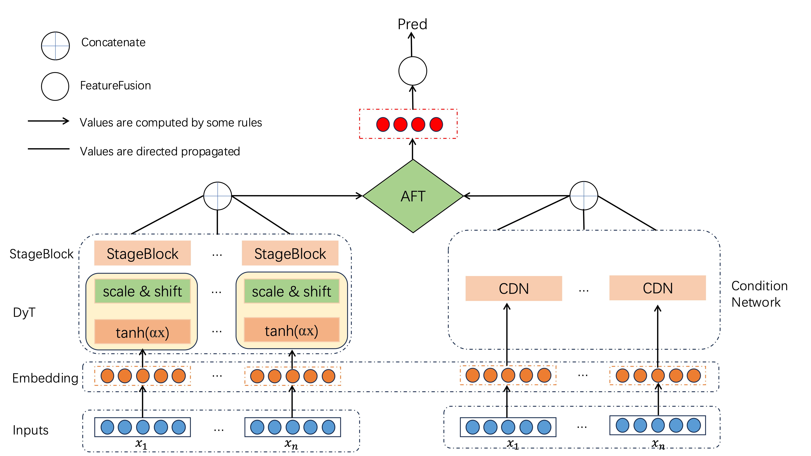

# DAFT-NET: 动态自适应融合Transformer网络用于心血管疾病预测

## 📋 项目概述

DAFT-NET (Dynamic Adaptive Fusion Transformer Network) 是一个基于深度学习的多模态心血管疾病预测系统，能够融合多种医疗数据源（基础信息、血液检测、医学影像报告文本）进行心血管疾病风险预测。

## 🎯 研究背景

心血管疾病是全球主要的死亡原因之一。传统的风险评估方法主要依赖单一数据源，缺乏对多模态医疗数据的有效融合。DAFT-NET通过创新的动态自适应融合机制，能够更好地利用多源异构医疗数据进行精准预测。

## 🏗️ 技术架构

### 核心创新点

1. **动态自适应融合机制**: 基于条件网络生成动态权重，根据患者个体特征自适应调整不同数据源的重要性
2. **多模态数据融合**: 有效融合基础信息、血液检测结果和医学影像报告文本
3. **改进的AFT (Attention Free Transformer)**: 结合动态位置偏置和条件权重，提升模型性能
4. **两阶段特征抽象**: 通过StageBlock实现渐进式特征提取

### 模型架构




## 📊 数据说明

### 数据来源
- **公开数据集**
- **私人数据集**


## 🚀 快速开始

### 环境要求

```bash
Python >= 3.8
PyTorch >= 2.0.1
pandas >= 2.2.3
scikit-learn >= 1.6.0
numpy >= 1.23.5
```

### 安装依赖

```bash
cd code
pip install -r requirements.txt
```

## 📈 实验结果

### 评估指标
- **准确率 (Accuracy)**: 分类准确性
- **AUC-ROC**: 受试者工作特征曲线下面积
- **MSE**: 均方误差
- **召回率 (Recall)**: 敏感性
- **F1分数**: 精确率和召回率的调和平均

### 性能表现
- 在心血管疾病预测任务上达到优秀的性能
- 相比传统方法显著提升预测准确性
- 动态融合机制有效提升模型泛化能力


## 📄 许可证

本项目采用MIT许可证 - 详见 [LICENSE](LICENSE) 文件


---

**注意**: 本项目仅用于研究目的，不构成医疗建议。在实际医疗应用中，请遵循相关法规和伦理准则。


